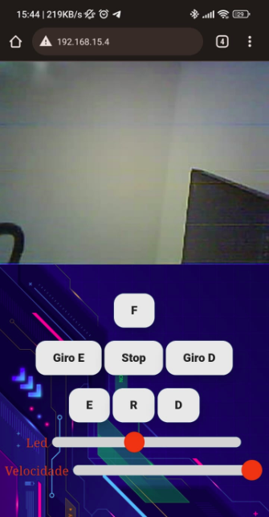
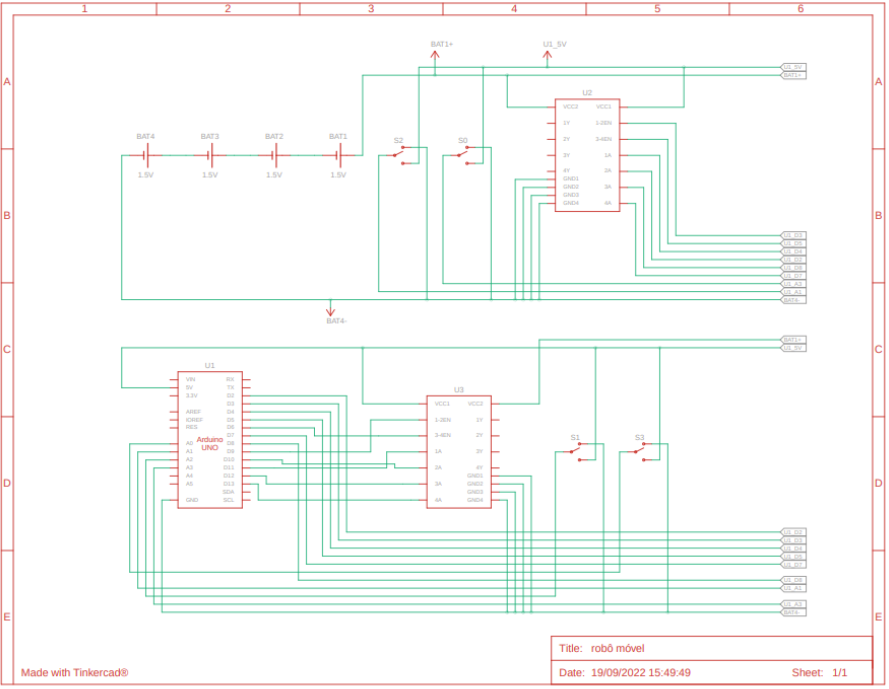
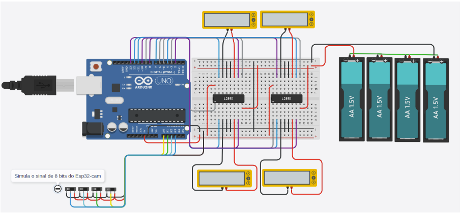

# Robo Móvel
### Objetivo:
Construir um carro capaz de ser controlado via wireless e capaz de se movimentar para frente, ré, direita e esquerda, além de poder mudar sua direção. Capaz de realizar streaming de vídeo para um pagina web. 

### Escopo:
Este projeto é uma adaptação do projeto: https://github.com/un0038998/CameraCarWithPanTiltControl 
Tomando como base o projeto inicial Ujwal Nandanwar, que consiste em um esp32-cam conectado a uma ponteH para controlar o carro com 4 motores. Optamos por utilizar o programa original do esp32-cam realizando algumas alterações de layout e re-implementando as funcionalidades, uma vez que para nosso projeto decidimos utilizar rodas que possibilitem o carro se mover em qualquer direção, de tal forma que é necessário ter o controle individual de cada roda.
Utilizamos um Arduino Uno e uma shield ponte-h além de um powerbank.

### Layout da web application:

### Diagrama construído thinkcad para simular a comunicação do Esp-32 cam com o Arduino Uno.

A comunicação feita do esp-32 cam para o Arduino Uno é um sinal binário de 4bits, o que possibilita 16 comando diferentes para o arquino.

### Peças utilizadas:
* Arduino Uno R3
* MotorShield PonteH
* Esp-32 Cam
* Motor de 3-6v com redução (x4)
* Chassi de metal
* Rodas omnidirecionais (x4)

